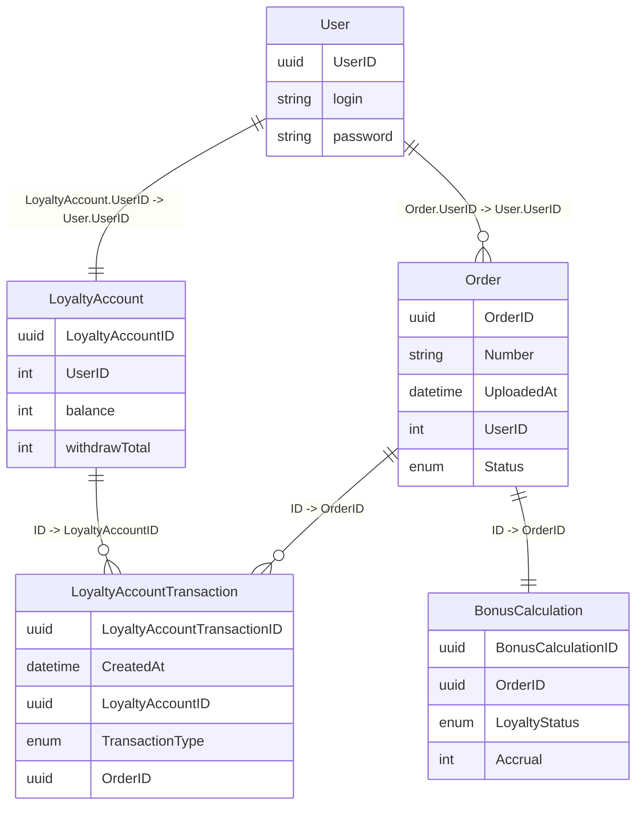

# Gopher loyalty project

#Docs

Схема БД и сущностей DDD (1 к 1)

```mermaid
erDiagram
    User {
        uuid UserID
        string login
        string password
    }

    LoyaltyAccount {
        uuid LoyaltyAccountID
        int UserID
        int balance
        int withdrawTotal
    }

    LoyaltyAccountTransaction {
        uuid LoyaltyAccountTransactionID
        datetime CreatedAt
        uuid LoyaltyAccountID
        enum TransactionType
        uuid OrderID
    }

    Order {
        uuid OrderID
        string Number
        datetime UploadedAt
        int UserID
        enum Status
    }

    BonusCalculation {
        uuid BonusCalculationID
        uuid OrderID
        enum LoyaltyStatus
        int Accrual
    }

    User ||--o{ Order : "Order.UserID -> User.UserID"
    User ||--|| LoyaltyAccount : "LoyaltyAccount.UserID -> User.UserID"
    LoyaltyAccount ||--o{ LoyaltyAccountTransaction : "ID -> LoyaltyAccountID"
    Order ||--o{ LoyaltyAccountTransaction : "ID -> OrderID"
    Order ||--|| BonusCalculation : "ID -> OrderID"
```