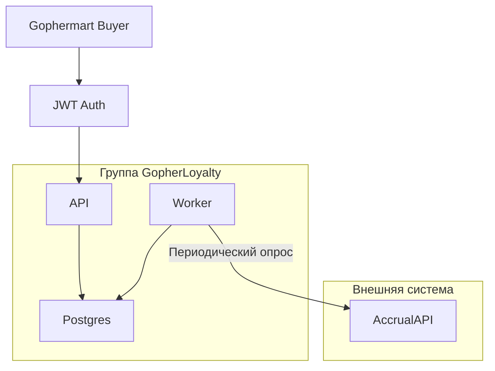
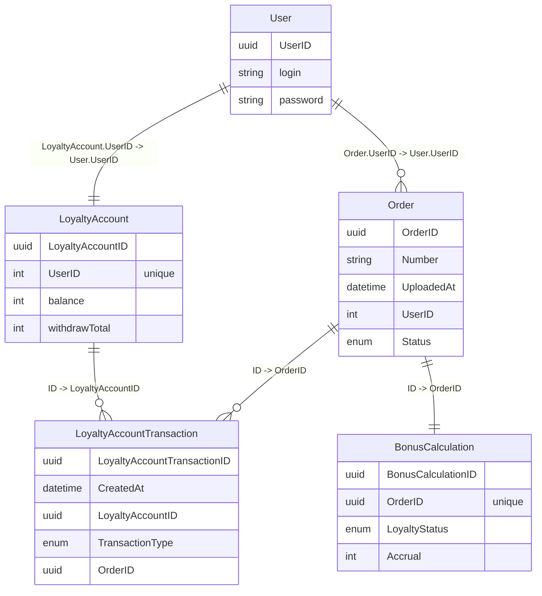

# Gopher loyalty project

# Docs

Планы как сделаю проект:
- Использую DDD подход для организации структуры проекта и кода.
- Выделю Worker как отдельное приложение (если успею, иначе будет внутри API жить), которое будет работать с единой БД Postgres.
- Worker будет заниматься опросом AccrualAPI для получения резульата обработки.
- Для аутентификации применю JWT.
- Для генерации http api применю подход через написание спеки openapi v3 + кодогенерацию + пакет go-chi.
- Для поддержания актуальной документации воспользуюсь пакетом swaggest.
- Работа с БД через database/sql.

Схема модулей проекта

Схема БД и сущностей DDD (1 к 1)

